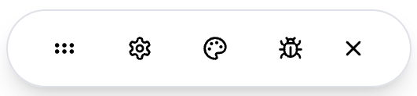

# 📏 react-devbar

A customizable floating toolbar for React applications. Build and integrate your own dev tools with a draggable interface inspired by the Vercel toolbar. Perfect for adding debugging panels, theme controls, and other development utilities for your app. Check out the [Storybook](https://timmikeladze.github.io/react-devbar/) for a live demo.




## ✨ Features

✅ Fully customizable, with custom icons, styles, and components.
✅ Toggle it with a hotkey.
✅ Drag it anywhere on the screen.
✅ Use default styles or style it yourself. Seamlessly integrates with Tailwind and supports dark-mode.


## 📡 Install

```console
npm install react-devbar

yarn add react-devbar

pnpm add react-devbar
```

> 👋 Hello there! Follow me [@linesofcode](https://twitter.com/linesofcode) or visit [linesofcode.dev](https://linesofcode.dev) for more cool projects like this one.

## 🚀 Getting started

```tsx
import { DevBar } from "react-devbar";
import { Bug, Palette, Settings } from "lucide-react";
// if you're not using Tailwind, you can import default styles
import "react-devbar/styles.css";

const tools = [
	{
		icon: Settings,
	},
	{
		icon: Palette,
	},
	{
		icon: Bug,
	},
];


// somewhere in your app render:
<DevBar tools={tools} />
```

## Available props

### DevBarTool

Each tool in the `tools` array can have the following properties:

| Property    | Type                  | Required | Description                                                |
|------------|----------------------|----------|------------------------------------------------------------|
| name       | string               | No       | The name of the tool (used for tooltips)                   |
| icon       | React.ElementType    | Yes      | The icon component to display                              |
| Component  | React.ComponentType  | No       | The component to render when the tool is selected          |

### DevBarProps

| Property                  | Type                                      | Default     | Description                                                    |
|--------------------------|-------------------------------------------|-------------|----------------------------------------------------------------|
| tools                    | Tool[]                                    | -           | Array of tools to display in the toolbar                        |
| orientation              | "horizontal" \| "vertical"                | "horizontal"| Orientation of the toolbar                                      |
| defaultPosition          | Position \| { x: number; y: number }      | "bottom-right" | Initial position of the toolbar                             |
| defaultOpen              | boolean                                   | false       | Whether the toolbar is initially open                           |
| hotkey                   | string                                    | -           | Keyboard shortcut to toggle the toolbar                         |
| hotKeyOptions            | Options                                   | -           | Options for the hotkey behavior                                 |
| CommandIcon             | React.ElementType                         | -           | Custom command icon component                                   |
| GripIcon                | React.ElementType                         | -           | Custom grip icon component                                      |
| CloseIcon               | React.ElementType                         | -           | Custom close icon component                                     |
| containerClassName      | string                                    | -           | Class name for the main container                               |
| toolbarClassName        | string                                    | -           | Class name for the toolbar                                      |
| toolbarContentClassName | string                                    | -           | Class name for the toolbar content                              |
| moveButtonClassName     | string                                    | -           | Class name for the move button                                  |
| toolsContainerClassName | string                                    | -           | Class name for the tools container                              |
| toolButtonClassName     | string                                    | -           | Class name for individual tool buttons                          |
| controlsContainerClassName | string                                 | -           | Class name for the controls container                           |
| closeButtonClassName    | string                                    | -           | Class name for the close button                                 |
| openButtonClassName     | string                                    | -           | Class name for the open button                                  |
| ButtonComponent         | typeof Button                             | -           | Custom button component                                         |
| TooltipComponent        | typeof Tooltip                            | -           | Custom tooltip component                                        |
| TooltipTriggerComponent | typeof TooltipTrigger                     | -           | Custom tooltip trigger component                                |
| TooltipContentComponent | typeof TooltipContent                     | -           | Custom tooltip content component                                |
| TooltipProviderComponent| typeof TooltipProvider                    | -           | Custom tooltip provider component                               |
| moveButtonLabel         | string                                    | -           | Accessibility label for the move button                         |
| closeToolbarLabel       | string                                    | -           | Accessibility label for the close button                        |
| openToolbarLabel        | string                                    | -           | Accessibility label for the open button                         |

#### DevBarPosition Types

The `defaultPosition` prop accepts the following position values:

- `"top-left"`
- `"top-center"` 
- `"top-right"`
- `"bottom-left"`
- `"bottom-center"`
- `"bottom-right"`
- `"center-left"`
- `"center-right"`
- `"center"`

Or an object with `x` and `y` coordinates for precise positioning.
